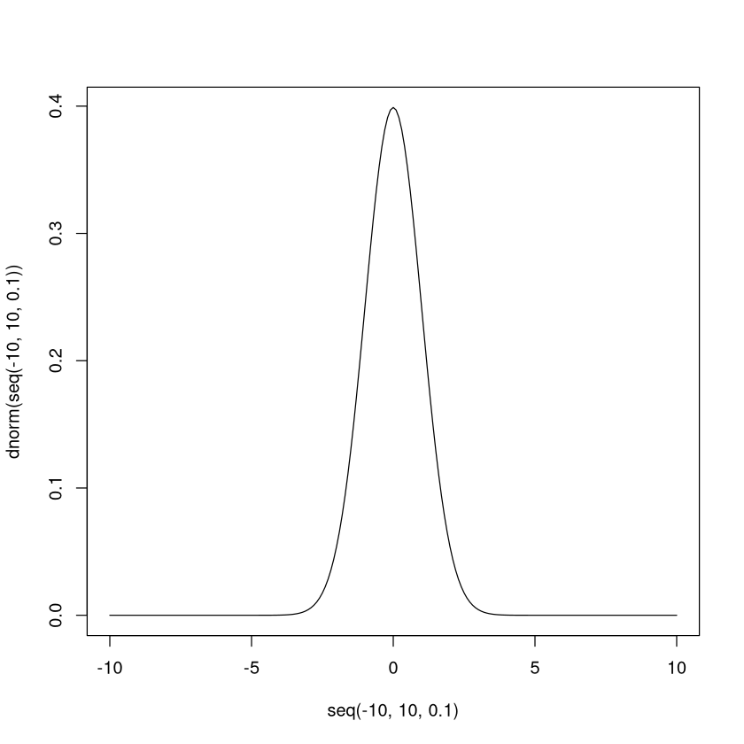
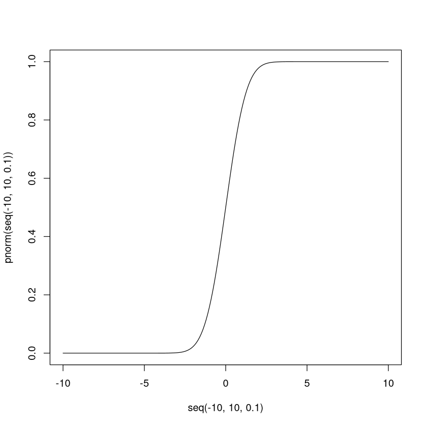
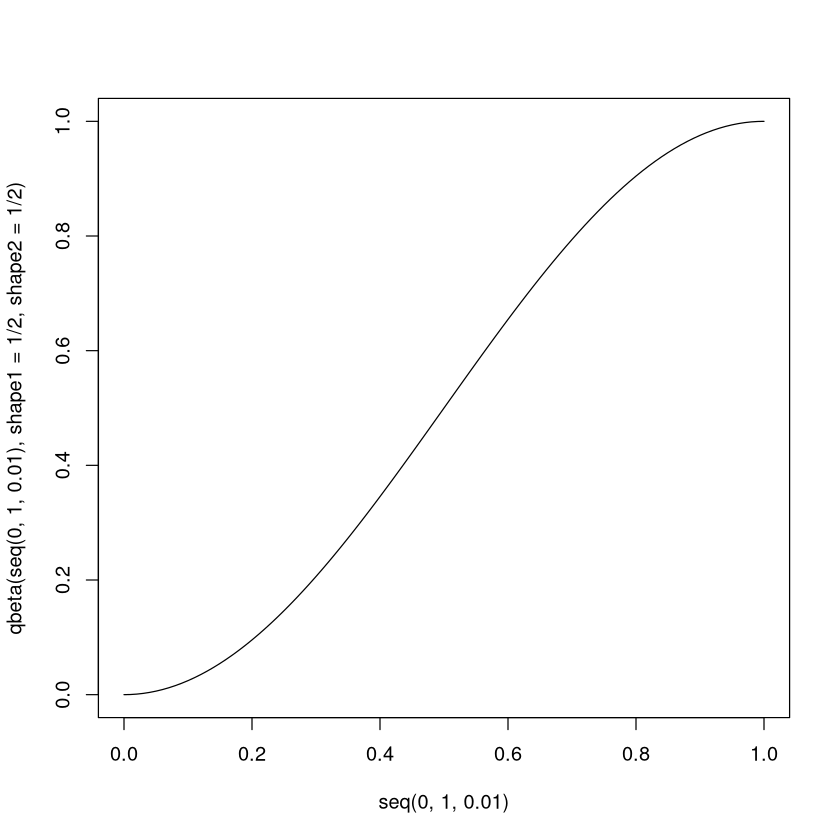
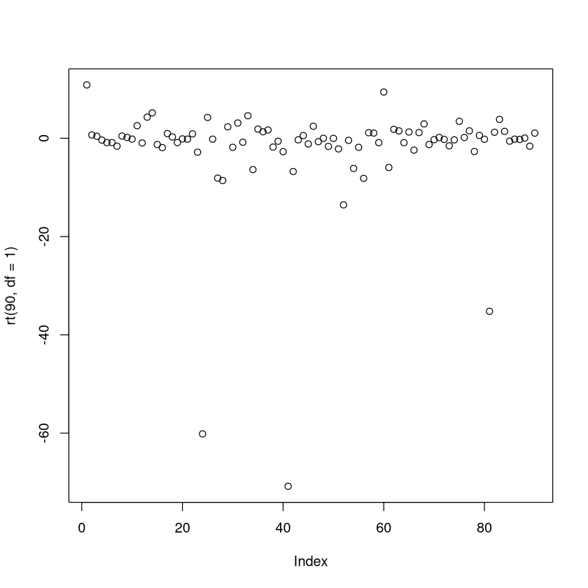
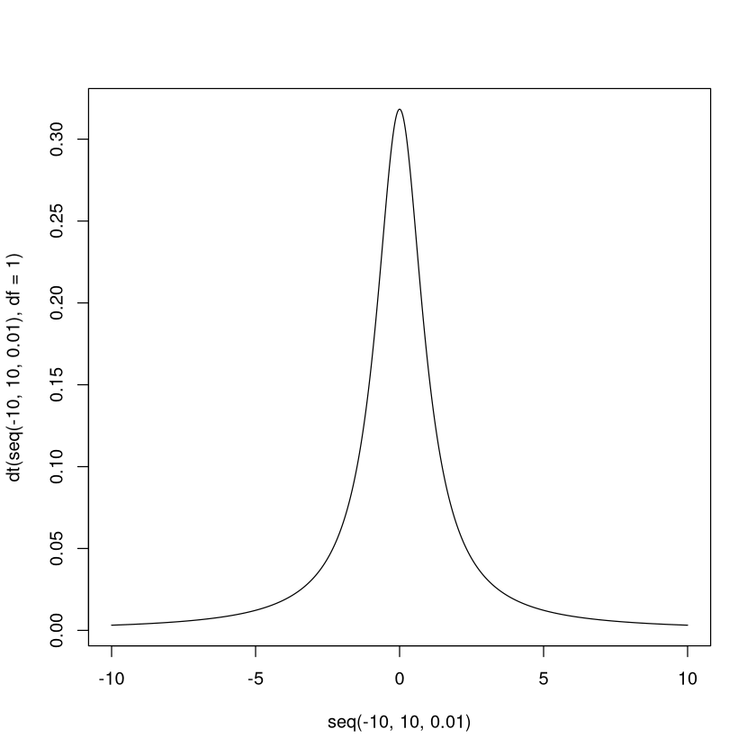
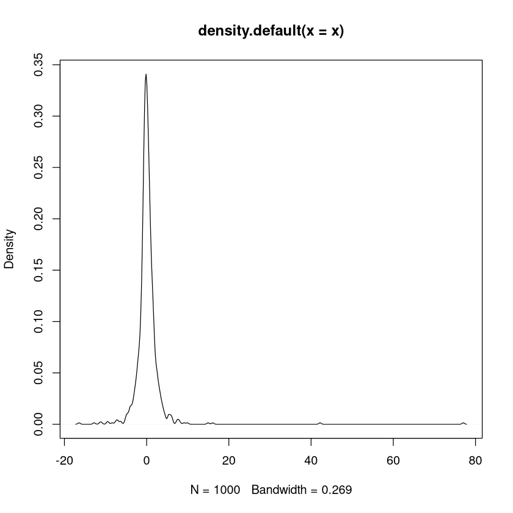
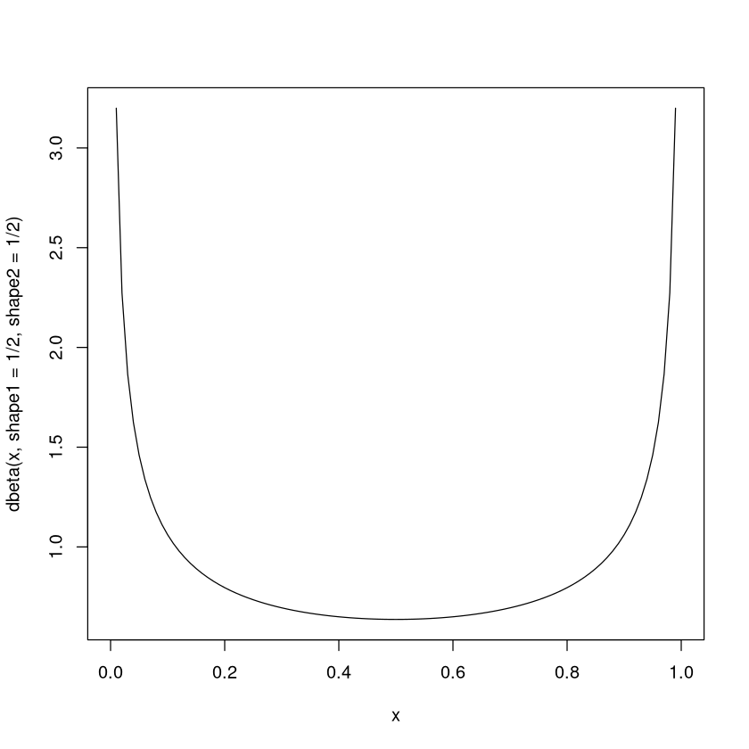
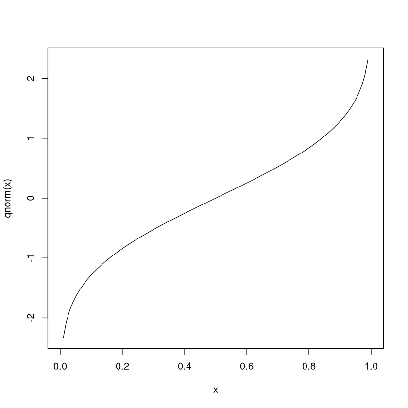
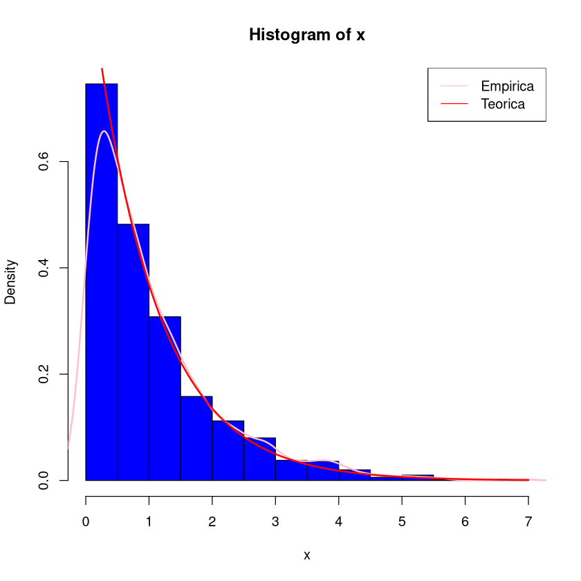

# **INFERENCIA ESTADISTICA**
---
## **Simulacion de variables aleatorias en R**

**Profesor**: *Gonzalo Perez de la Cruz*

**Ayudante**: *Alexis Adrian Carrillo Medina*

**Ayudante**: *Dioney Alonso Rosas Sanchez*

**Ayudante** : *Gerardo Cruz García*

**Ayudante** : *Juan Andrés Cervantes Sandoval*

---

## Introduccion

**En esta clase simularemos distintas variables aleatorias en R <br>**
R tiene 4 funciones para esto (Estas funciones estan definidas para muchas mas variables aleatorias, pero para ejemplificar usaremos la de una normal) <br>

- **dnorm** : *Funcion de Densidad de Probabilidad (PDF en ingles).*
- **pnorm** : *Funcion de Distribucion de Probabilidad de una normal (CDF en ingles; probabilidad acumulada).*
- **qnorm** : *Funcion de Cuantiles de una normal.*
- **rnorm** : *Generador aleatorio de numeros con distribucion normal.*

# Distribuciones

Para ver las distribuciones disponibles ejecutamos


```R
?distributions
```


<table width="100%" summary="page for Distributions {stats}"><tr><td>Distributions {stats}</td><td style="text-align: right;">R Documentation</td></tr></table>

<h2>Distributions in the stats package</h2>

<h3>Description</h3>

<p>Density, cumulative distribution function, quantile function and random
variate generation for many standard probability distributions are
available in the <span class="pkg">stats</span> package.
</p>


<h3>Details</h3>

<p>The functions for the density/mass function, cumulative distribution
function, quantile function and random variate generation are named in the
form <code>dxxx</code>, <code>pxxx</code>, <code>qxxx</code> and <code>rxxx</code> respectively.
</p>
<p>For the beta distribution see <code>dbeta</code>.
</p>
<p>For the binomial (including Bernoulli) distribution see
<code>dbinom</code>.
</p>
<p>For the Cauchy distribution see <code>dcauchy</code>.
</p>
<p>For the chi-squared distribution see <code>dchisq</code>.
</p>
<p>For the exponential distribution see <code>dexp</code>.
</p>
<p>For the F distribution see <code>df</code>.
</p>
<p>For the gamma distribution see <code>dgamma</code>.
</p>
<p>For the geometric distribution see <code>dgeom</code>.  (This is also
a special case of the negative binomial.)
</p>
<p>For the hypergeometric distribution see <code>dhyper</code>.
</p>
<p>For the log-normal distribution see <code>dlnorm</code>.
</p>
<p>For the multinomial distribution see <code>dmultinom</code>.
</p>
<p>For the negative binomial distribution see <code>dnbinom</code>.
</p>
<p>For the normal distribution see <code>dnorm</code>.
</p>
<p>For the Poisson distribution see <code>dpois</code>.
</p>
<p>For the Student's t distribution see <code>dt</code>.
</p>
<p>For the uniform distribution see <code>dunif</code>.
</p>
<p>For the Weibull distribution see <code>dweibull</code>.
</p>
<p>For less common distributions of test statistics see
<code>pbirthday</code>, <code>dsignrank</code>,
<code>ptukey</code> and <code>dwilcox</code> (and see the
&lsquo;See Also&rsquo; section of <code>cor.test</code>).
</p>


<h3>See Also</h3>

<p><code>RNG</code> about random number generation in <span style="font-family: Courier New, Courier; color: #666666;"><b>R</b></span>.
</p>
<p>The CRAN task view on distributions,
<a href="https://CRAN.R-project.org/view=Distributions">https://CRAN.R-project.org/view=Distributions</a>,
mentioning several CRAN packages for additional distributions.
</p>

<hr /><div style="text-align: center;">[Package <em>stats</em> version 4.0.3 ]</div>


## Funcion de densidad

**dnorm** (funcion de densidad $f$)<br>
Es la funcion con forma de campana que la mayoria conocemos.
Calcula para cada punto observado el valor de la funcion de densidad.

Ejemplo de una normal(0,1) evaluado en 0 


```R
dnorm(0)
```


0.398942280401433


Ejemplo de una exponencial(2) evaluada en 1


```R
dexp(1,rate=2)
```


0.270670566473225


Observemos que la grafica de la densidad dada por esta funcion coincide con la densidad teorica


```R
plot(seq(-10,10,0.1),dnorm(seq(-10,10,0.1)),type="l")
```


    

    


## Funcion de distribucion

**pnorm** (funcion de distribucion $F$)<br>
Es la funcion que describe $\mathbb{P}(Y \leq X)$ probabilidad de que $Y$ sea
menor o igual a $X$, siendo $X$ cualquier valor en el dominio e Y una variable aleatoria
tomada de una distribucion normal. <br>
Recuerden que se encuentra entre 0 y 1.

Valor de la funcion de distribucion de una normal(0,1) en 0


```R
pnorm(0)
```


0.5


Valor de la funcion de distribucion de una Uniforme(0,7) en 5


```R
punif(5,min=0,max=7)
```


0.714285714285714


Grafica de la funcion de distribucion


```R
plot(seq(-10,10,0.1),pnorm(seq(-10,10,0.1)), type="l")
```


    

    


## Funcion de cuantiles

qnorm es la funcion que utilizamos para encontrar los cuantiles de una 
normal


```R
qnorm(.5) #Cuantil al 50% (tambien conocido como la mediana)
```


0


```R
qbeta(0.2,shape1=1/2,shape2 = 1/2) #Cuantil al 20% de una Beta(1/2,1/2)
```


0.0954915028125263


Veamos la grafica


```R
plot(seq(0,1,0.01),qbeta(seq(0,1,0.01),shape1=1/2,shape2 = 1/2),type="l")
```


    

    


## Simulacion de variables aleatorias

rnorm es la funcion utilizada para simular numeros aleatorios <br>
En este caso de una normal

Antes de simular, fijemos una semilla<br>
Esto servira para que los numeros aleatorios sean los mismos siempre


```R
set.seed(2)
```

Simulemos normales


```R
rnorm(5) # 5 variables aleatorias normales(0,1)
```


<style>
.list-inline {list-style: none; margin:0; padding: 0}
.list-inline>li {display: inline-block}
.list-inline>li:not(:last-child)::after {content: "\00b7"; padding: 0 .5ex}
</style>
<ol class=list-inline><li>-0.896914546624981</li><li>0.184849184646742</li><li>1.58784533120882</li><li>-1.13037567424629</li><li>-0.0802517565509893</li></ol>


Simulemos T-Student


```R
rt(7,df=4) # 7 variables aleatorios t-student con 4 grados de libertad
```


<style>
.list-inline {list-style: none; margin:0; padding: 0}
.list-inline>li {display: inline-block}
.list-inline>li:not(:last-child)::after {content: "\00b7"; padding: 0 .5ex}
</style>
<ol class=list-inline><li>0.118621602857939</li><li>-0.152903461176281</li><li>-0.13691304996086</li><li>1.35006989650831</li><li>-0.776556406059754</li><li>0.999908488907449</li><li>0.994085981495103</li></ol>


Veamos la grafica de estas variables simuladas


```R
plot(rt(90,df=1)) # Grafica de 90 variables t-student(1)
```


    

    


Y observemos que coinciden con como es la funcion de distribucion


```R
plot(seq(-10,10,0.01),dt(seq(-10,10,0.01),df=1),type="l")
```


    

    


Veamos otra prueba para ver que en efecto su distribucion coincide


```R
x<-rt(1000,df=2) #Simulamos 100 t-student
mean(x) #Deberia encajar con la esperanza de una t-student(2) que es 0 (Aqui no se apreciara tanto por que la estadistica tiene punto de quiebre en 0%)
plot(density(x)) #Deberia encajar con la densidad
```


0.171581979840039


    

    


## Otra forma de graficar

Podemos utilizar la funcion curves para graficar cualquier tipo de funciones que definamos o esten predefinidas


```R
curve(dbeta(x,shape1=1/2,shape2 = 1/2),from=0,to=1)
```


    

    


```R
curve(qnorm(x),from=0,to=1)
```


    

    


## Combinando todo

Podemos combinar todo lo visto hasta el momento para crear...


```R
x <- rgamma(1000,rate=1,shape=1)
hist(x,col="blue",freq=F)
lines(density(x),col="pink",lw=2)
curve(dgamma(x,rate = 1,shape=1),lw=2,add=T,col="red")
legend(x="topright",legend=c("Empirica","Teorica"),lty = 1,col=c("pink","red"))
```


    

    

