# **INFERENCIA ESTADISTICA**
---
## **Introduccion a la graficacion en R**

**Profesor**: *Gonzalo Perez de la Cruz*

**Ayudante**: *Alexis Adrian Carrillo Medina*

**Ayudante**: *Dioney Alonso Rosas Sanchez*

**Ayudante** : *Gerardo Cruz García*

**Ayudante** : *Juan Andrés Cervantes Sandoval*

---

## Introduccion

**Esta clase esta enfocada a la graficacion de datos en R
apartir de bases de una base de datos real graficaremos 
y obtendremos informacion de las graficas.** <br>

Utilizaremos 2 bases de datos: **datos.csv** y **datos2.csv** <br>
Las pueden descargar en la siguiente liga: [Bases de datos](https://drive.google.com/drive/folders/1jfCQEwpVRWgPDK2iJmFYtgQXniFeHoJ6?usp=sharing)

R cuenta con 4 sistemas de graficacion.  <br>
*base graphics, grid graphics, lattice graphics, y ggplot2*.  <br>
Para este curso utilizaremos base graphics, no sin antes exhortarlos
a indagar sobre los graficos *ggplot2* que son los que mas se utilizan en la practica.

## Antes de iniciar

Recuerden que antes de iniciar un nuevo script de R es recomendable
borrar todos los objetos del ambiente para no causar errores.
Para ello podemos ejecutar el siguiente codigo


```R
rm(list = ls(all.names =  TRUE)) 
gc()
```

Para esta clase utilizaremos las siguientes librerias


```R
library(readr) #para utilizar la funci?n read_csv
library(corrplot) #para el grafico de correlaciones
library(fdth) #para el calculo de distribuci?n de frecuencias
library(car) #para utilizar qqPlot
```

    corrplot 0.84 loaded
    
    
    Attaching package: ‘fdth’
    
    
    The following objects are masked from ‘package:stats’:
    
        sd, var
    
    
    Loading required package: carData
    


Para poder cargar nuestra base de datos necesitamos cambiar el 
directorio de trabajo a donde se encuentre nuesta base de datos. <br>
En este ejemplo yo puse mi directorio, pero es necesario que ustedes pongan el directorio donde guardaron las bases de datos


```R
setwd("/home/a-carrillo/Documents/Escuela/Ayudantias/Inferencia estadistica/R/Ayudantia 1")
```

Carguemos nuestro base de datos


```R
datos = read_csv("datos.csv") # guardamos en una variable "datos"
```

    Parsed with column specification:
    cols(
      ENT = col_double(),
      Entidad = col_character(),
      MUN = col_double(),
      Municipio = col_character(),
      Alf = col_double(),
      Asi = col_double(),
      EBC = col_double(),
      Der = col_double(),
      Pis = col_double(),
      San = col_double(),
      Agu = col_double(),
      Dre = col_double(),
      Ele = col_double(),
      Lav = col_double(),
      Ref = col_double(),
      Ing = col_double()
    )
    


Para comprender la estructura de la base de datos


```R
str(datos) 
```

    tibble [245 × 16] (S3: spec_tbl_df/tbl_df/tbl/data.frame)
     $ ENT      : num [1:245] 1 1 1 1 2 2 2 2 3 3 ...
     $ Entidad  : chr [1:245] "Aguascalientes" "Aguascalientes" "Aguascalientes" "Aguascalientes" ...
     $ MUN      : num [1:245] 1 3 5 7 1 2 3 4 1 2 ...
     $ Municipio: chr [1:245] "Aguascalientes" "Calvillo" "Jesús María" "Rincón de Romos" ...
     $ Alf      : num [1:245] 0.979 0.952 0.968 0.965 0.964 ...
     $ Asi      : num [1:245] 0.965 0.956 0.959 0.977 0.966 ...
     $ EBC      : num [1:245] 0.736 0.507 0.66 0.676 0.66 ...
     $ Der      : num [1:245] 0.854 0.903 0.859 0.892 0.862 ...
     $ Pis      : num [1:245] 0.995 0.989 0.991 0.991 0.986 ...
     $ San      : num [1:245] 0.991 0.987 0.987 0.967 0.853 ...
     $ Agu      : num [1:245] 0.993 0.99 0.991 0.984 0.927 ...
     $ Dre      : num [1:245] 0.995 0.991 0.993 0.974 0.912 ...
     $ Ele      : num [1:245] 0.998 0.994 0.995 0.992 0.986 ...
     $ Lav      : num [1:245] 0.863 0.845 0.846 0.782 0.796 ...
     $ Ref      : num [1:245] 0.947 0.927 0.919 0.886 0.913 ...
     $ Ing      : num [1:245] 15862 12185 23821 8753 14037 ...
     - attr(*, "spec")=
      .. cols(
      ..   ENT = col_double(),
      ..   Entidad = col_character(),
      ..   MUN = col_double(),
      ..   Municipio = col_character(),
      ..   Alf = col_double(),
      ..   Asi = col_double(),
      ..   EBC = col_double(),
      ..   Der = col_double(),
      ..   Pis = col_double(),
      ..   San = col_double(),
      ..   Agu = col_double(),
      ..   Dre = col_double(),
      ..   Ele = col_double(),
      ..   Lav = col_double(),
      ..   Ref = col_double(),
      ..   Ing = col_double()
      .. )


Ver el encabezado de nuestra base de datos <br>
En este caso no lo imprimiremos, pero este es comando <br>
Mas adelante veremos un ejemplo

```R
head(datos)
```

Para poder entender la base de datos, necesitamos una descripcion


### Descripcion de la base de datos

Hay que entender como esta conformada la base de datos:

Municipios del pais y conjuntos de variables sociodemograficas relevantes. <br>
**ENT**: Clave de la entidad <br>
**Entidad**: nombre de la entidad <br>
**MUN**: nombre del municipio <br>
**Municipio**: porcentaje de viviendas particulares habitadas con piso de tierra. <br>
**Alf**: porcentaje de poblaci?n de 15 o m?s a?os que sabe leer y escribir. <br>
**Asi**: porcentaje de poblaci?n de 6 a 14 a?os que asiste a la escuela. <br>
**EBC**: porcentaje de poblaci?n de 15 o m?s a?os con educaci?n b?sica completa. <br>
**Der**: porcentaje de poblaci?n con derechohabiencia a servicios de salud. <br>
**Pis**: porcentaje de viviendas particulares habitadas con piso diferente de tierra.<br>
**San**: porcentaje de viviendas particulares habitadas que disponen de excusado o sanitario.<br>
**Agu**: porcentaje de viviendas particulares habitadas que no disponen de agua potable.<br>
**Dre**: porcentaje de viviendas particulares habitadas que no disponen de drenaje.<br>
**Ele**: porcentaje de viviendas particulares habitadas que no disponen de electricidad.<br>
**Lav**: porcentaje de viviendas particulares habitadas que disponen de lavadora.<br>
**Ref**: porcentaje de viviendas particulares habitadas que disponen de refrigerador.<br>
**Ing**: Estimacion de la media del ingreso corriente mensual en los hogares.<br>

## Graficos

Lo primero que se nos podria ocurrir es graficar los datos <br>
La funcion **plot()** es la funcion generica para realizar graficos en 
primera instancia, R desplegara el grafico que considere mas adecuado 
para el tipo de variable que se esta tomando


```R
plot(datos[,5:16])
```


    
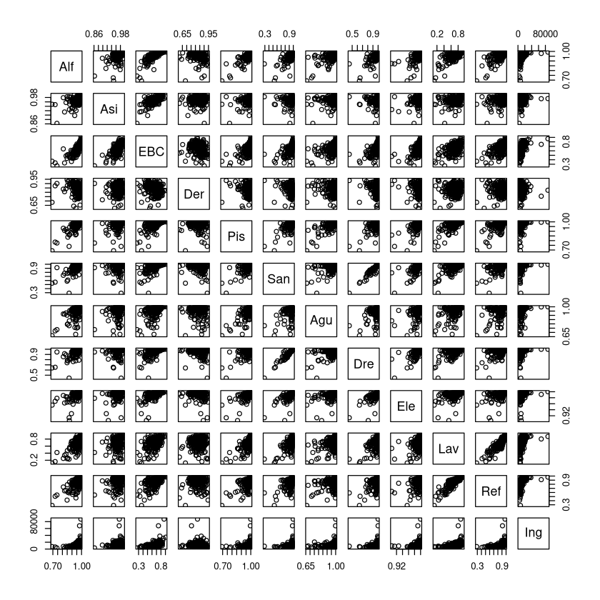
    


En este caso realiza un grafico de dispersion de todas las variables 2 a 2. <br>
Esta grafica no nos dice mucho e incluso es dificil de leer


Talvez es mas conveniente si encontramos relaciones entre las variables <br>
Esto lo haremos con la ayuda de la funcion **corrplot()**


```R
cor_datos = cor(datos[,5:16])
corrplot(cor_datos,method = "ellipse")
```


    
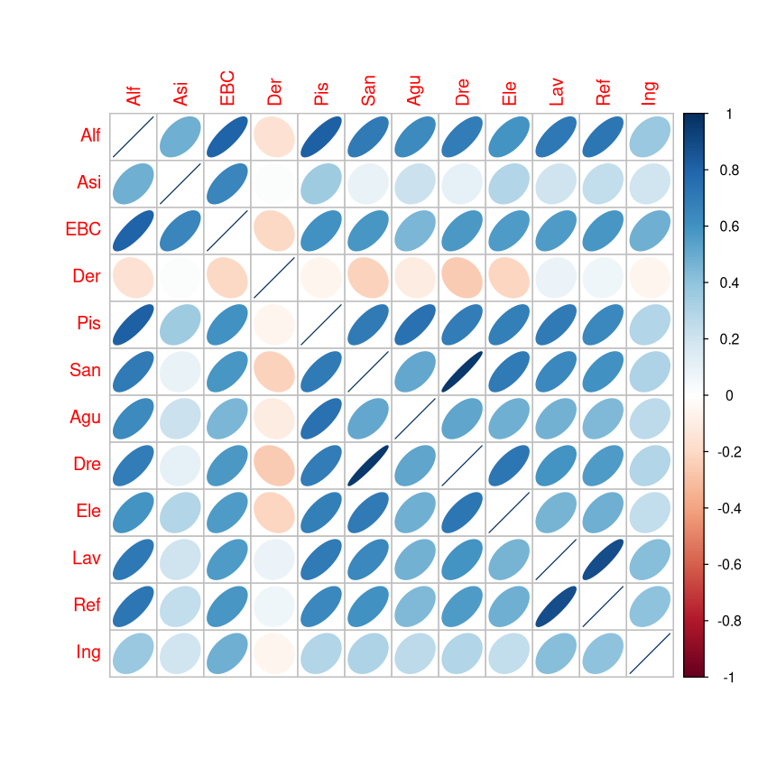
    


La grafica es mas legible, no obstante aun no es algo digno
de presentar

Sera mas sencillo si nos enfocamos en una variable en particular. <br>
Seleccionemos la variable ***Lav***, parece comportarse bien

veamos un grafico de los datos de esta variable


```R
plot(datos$Lav) 
```


    
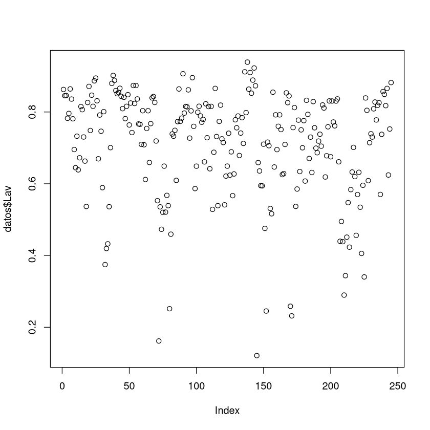
    


De nuevo, esto no nos dice nada... <br>
Para poder conocer mejor este variable necesitaremos presentar mas graficos

### Graficos para variables aleatorias continuas

#### Histograma

Para cada valor, categoria o clase de la variable, se asocia una barra
cuya altura es la frecuencia con la que se observa la categoria

Histograma de frecuencias absolutas para la variable Lav


```R
hist(datos$Lav, main="Histograma de la variable Lav",xlab = "Lav",
     ylab = "Frecuencia",col="deepskyblue3")
```


    

    


Histograma de frecuencias relativas para la variable Lav


```R
hist(datos$Lav, main="Histograma de la variable Lav",xlab = "Lav",
     ylab = "Frecuencia",col="deepskyblue3",freq = F)
```


    
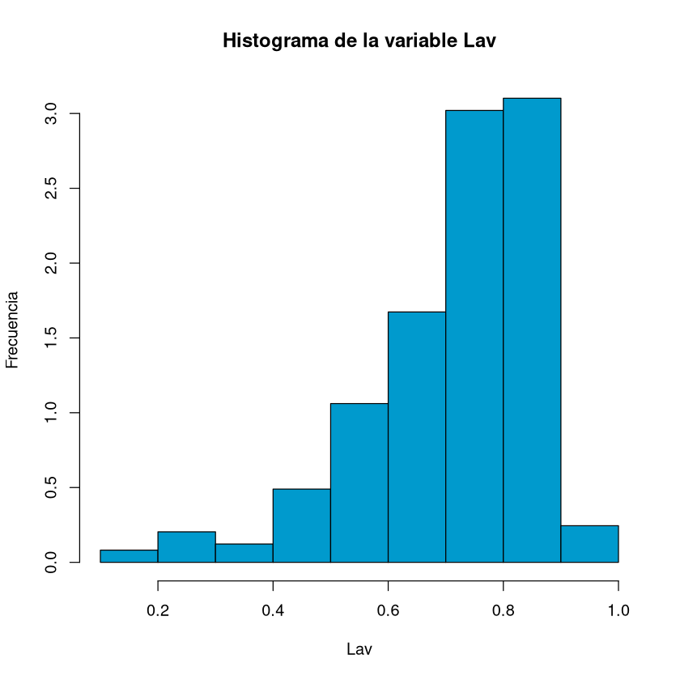
    


Podemos ver la densidad teorica de nuestra variable de interes con la funcion
**lines()**, la cual agrega curvas a la ultima grafica hecha. <br>
En este caso agregaremos la densidad y esto se hace con la funcion
**density()**


```R
hist(datos$Lav, main="Histograma de la variable Lav",xlab = "Lav",
     ylab = "Frecuencia",col="deepskyblue3",freq = F)
lines(density(datos$Lav),lwd=2)
```


    
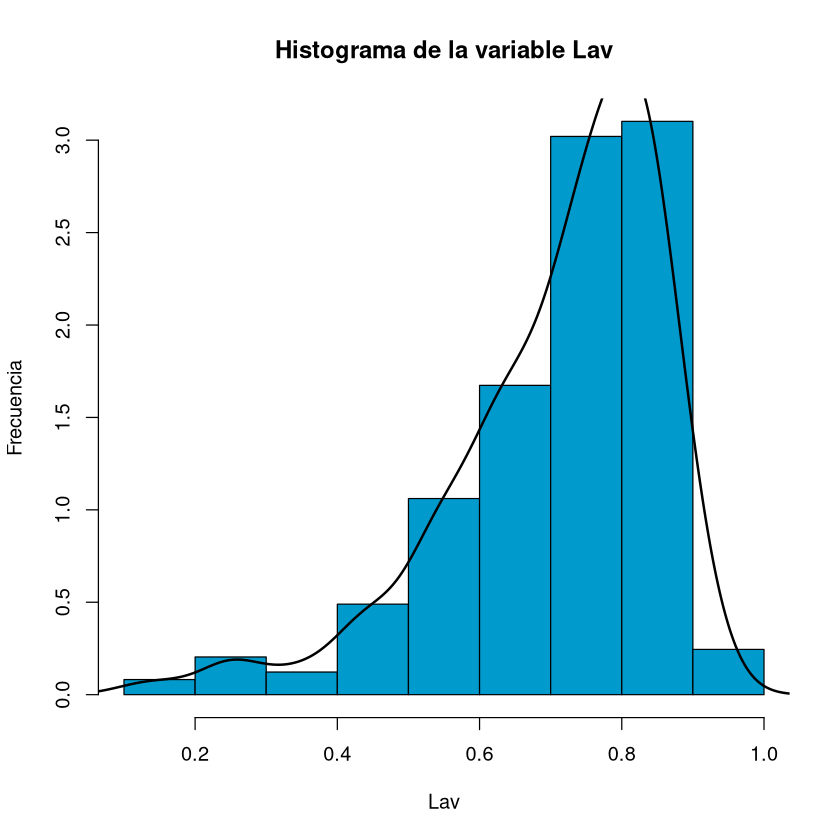
    


O bien verla sin el histograma


```R
plot(density(datos$Lav))
```


    
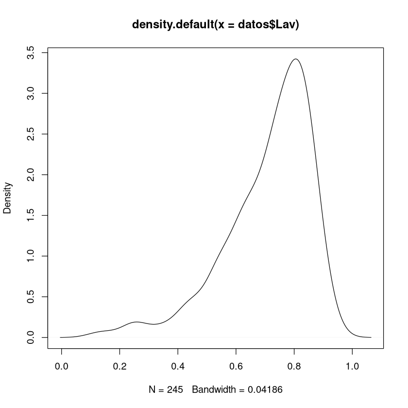
    


Tambien podemos calcular la funcion de distribucion empirica <br>
Aqui la calculamos de manera artesanal


```R
plot(cumsum(density(datos$Lav)$x))
```


    
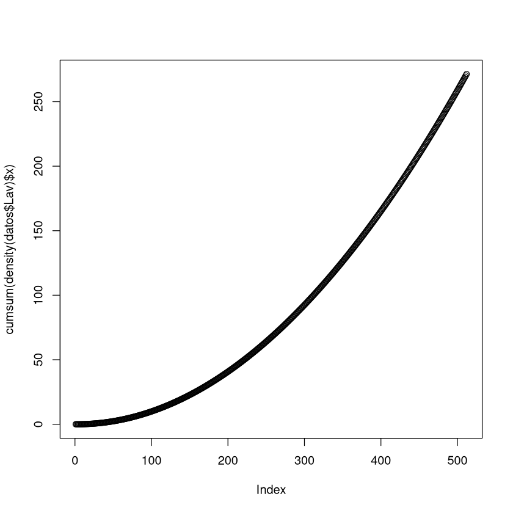
    


Para hacer que se vea como una linea agregamos el parametro **type = "l"**


```R
plot(cumsum(density(datos$Lav)$x),type="l")
```


    
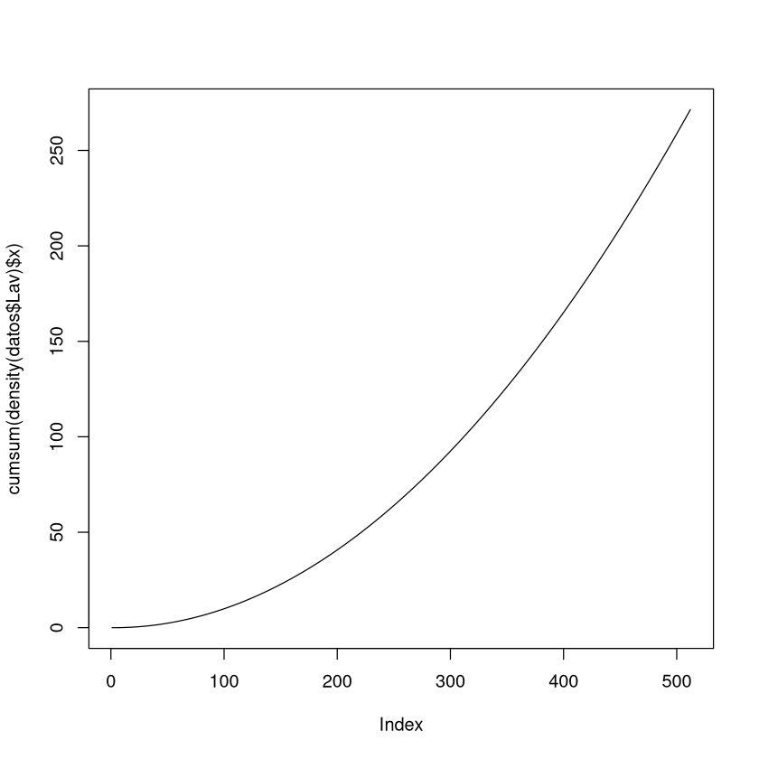
    


Una alternativa mejor es utilizar las funciones de la libreria ***fdth***


```R
dist <- fdt(datos$Lav,breaks="Sturges")
dist #nos brinda una tabla con los calculos de la distribuci?n de frecuencias.
```


<dl>
	<dt>$table</dt>
		<dd><table>
<caption>A data.frame: 9 × 6</caption>
<thead>
	<tr><th scope=col>Class limits</th><th scope=col>f</th><th scope=col>rf</th><th scope=col>rf(%)</th><th scope=col>cf</th><th scope=col>cf(%)</th></tr>
	<tr><th scope=col>&lt;fct&gt;</th><th scope=col>&lt;int&gt;</th><th scope=col>&lt;dbl&gt;</th><th scope=col>&lt;dbl&gt;</th><th scope=col>&lt;dbl&gt;</th><th scope=col>&lt;dbl&gt;</th></tr>
</thead>
<tbody>
	<tr><td>[0.1198,0.2119)</td><td> 2</td><td>0.008163265</td><td> 0.8163265</td><td>  2</td><td>  0.8163265</td></tr>
	<tr><td>[0.2119,0.3039)</td><td> 5</td><td>0.020408163</td><td> 2.0408163</td><td>  7</td><td>  2.8571429</td></tr>
	<tr><td>[0.3039,0.396) </td><td> 3</td><td>0.012244898</td><td> 1.2244898</td><td> 10</td><td>  4.0816327</td></tr>
	<tr><td>[0.396,0.4881) </td><td>11</td><td>0.044897959</td><td> 4.4897959</td><td> 21</td><td>  8.5714286</td></tr>
	<tr><td>[0.4881,0.5801)</td><td>20</td><td>0.081632653</td><td> 8.1632653</td><td> 41</td><td> 16.7346939</td></tr>
	<tr><td>[0.5801,0.6722)</td><td>38</td><td>0.155102041</td><td>15.5102041</td><td> 79</td><td> 32.2448980</td></tr>
	<tr><td>[0.6722,0.7643)</td><td>56</td><td>0.228571429</td><td>22.8571429</td><td>135</td><td> 55.1020408</td></tr>
	<tr><td>[0.7643,0.8563)</td><td>83</td><td>0.338775510</td><td>33.8775510</td><td>218</td><td> 88.9795918</td></tr>
	<tr><td>[0.8563,0.9484)</td><td>27</td><td>0.110204082</td><td>11.0204082</td><td>245</td><td>100.0000000</td></tr>
</tbody>
</table>
</dd>
	<dt>$breaks</dt>
		<dd><style>
.dl-inline {width: auto; margin:0; padding: 0}
.dl-inline>dt, .dl-inline>dd {float: none; width: auto; display: inline-block}
.dl-inline>dt::after {content: ":\0020"; padding-right: .5ex}
.dl-inline>dt:not(:first-of-type) {padding-left: .5ex}
</style><dl class=dl-inline><dt>start</dt><dd>0.11980434807</dd><dt>end</dt><dd>0.948405049</dd><dt>h</dt><dd>0.0920667445477778</dd><dt>right</dt><dd>0</dd></dl>
</dd>
</dl>


Donde: <br>
**f** = frecuencia absoluta <br>
**rf** = frecuencia relativa <br>
**rf(%)** = frecuencia relativa porcentual <br>
**cf** = frecuencia acumulada <br>
**cf(%)** = frecuencia acumulada porcentual <br>

Histograma de frecuencias acumulada


```R
plot(dist, type="cfh")
```


    
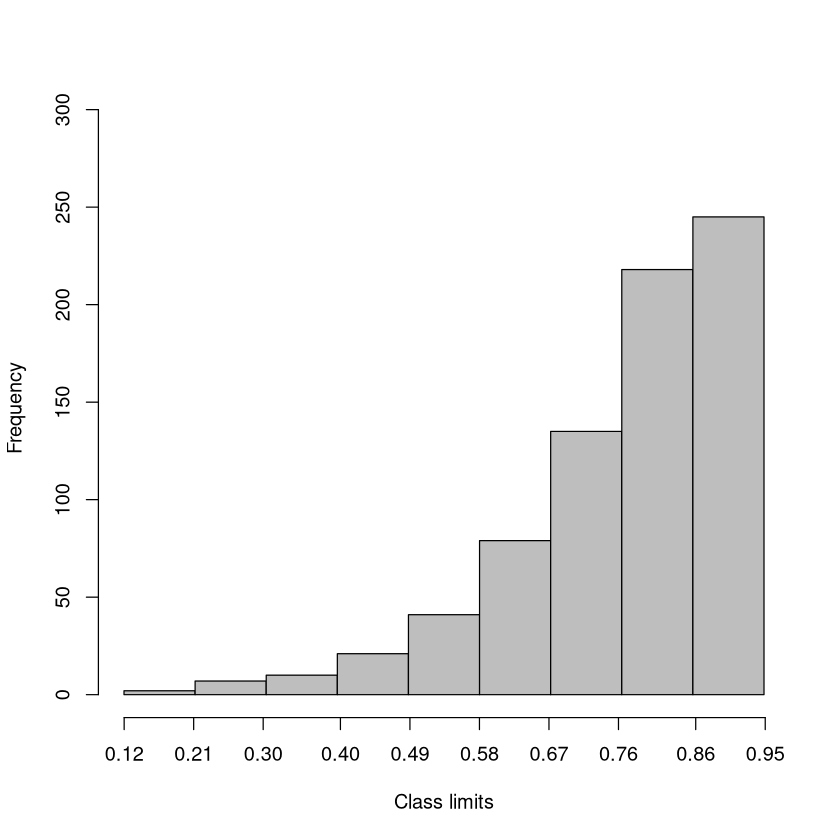
    


Poligono de frecuencias acumulado


```R
plot(dist, type="cfp")
```


    
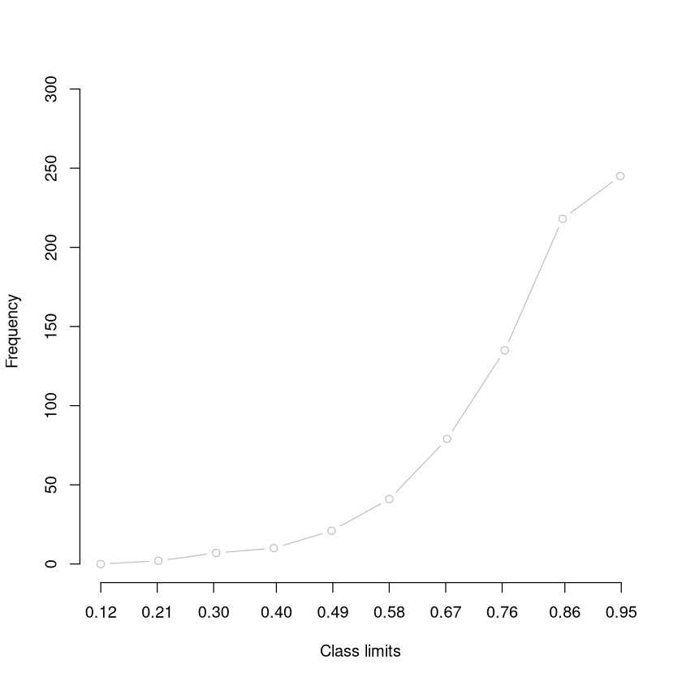
    


#### Boxplot

Tambien conocido como diagrama de caja y bigote. <br>
Es un metodo estandarizado para representar graficamente una serie de datos
numericos a traves de sus cuartiles. A su vez nos sirve a encontrar datos atipicos


```R
boxplot(datos$Lav)
```


    

    


Podemos verificar la construccion del
boxplot, viendo un resumen de nuestra 
variable 


```R
summary(datos$Lav)
```


       Min. 1st Qu.  Median    Mean 3rd Qu.    Max. 
     0.1210  0.6319  0.7489  0.7101  0.8192  0.9390 


Podemos hacer los boxplots para todas las variables


```R
boxplot(datos[,c(5:15)])
```


    
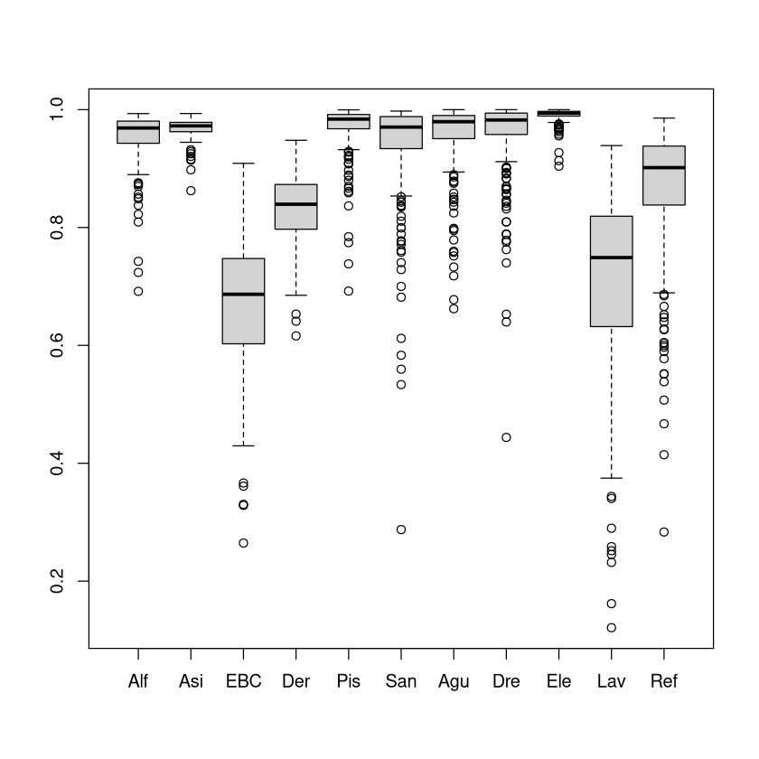
    


#### qqPlot

Tambien conocidos como graficos cuantil-cuantil <br>
Se utiliza para el diagnóstico de diferencias entre la distribución de probabilidad de una población de la que se ha extraído una muestra aleatoria y una distribución usada para la comparación.

Veamos un grafico *qqPlot*


```R
qqplot(datos$Lav, datos$Ref)
abline(0,1) #Para trazar la identidad y ver si sus distribuciones son iguales
```


    
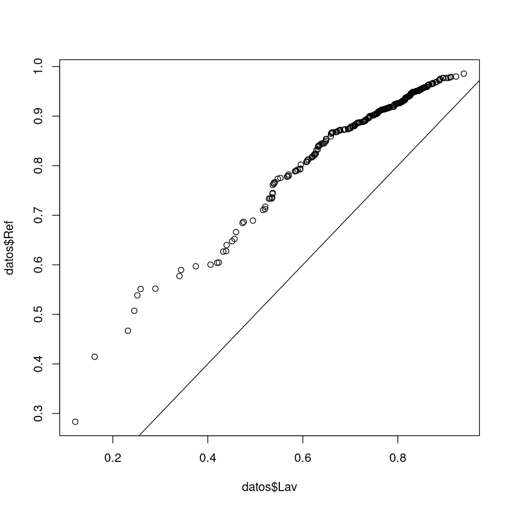
    


Uno de los principales usos del qqplot es ver 
si la distribuci?n de nuestra variable, o bien nuetra base de datos
es normal, graficando los cuantiles teoricos de una dist
normal, contra los cuantiles de la dist teorica de nuestra
variable


```R
qqnorm(datos$Lav) #Para compararlo con una normal
qqline(datos$Lav) #Para trazar la recta de comparacion
```


    
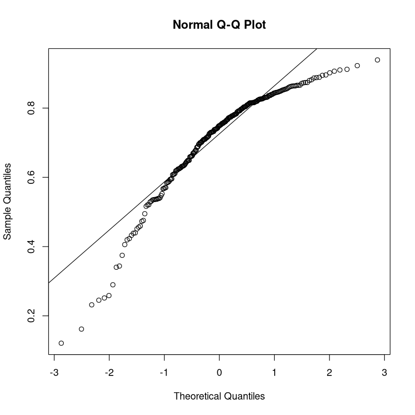
    


claramente observamos que esto no sigue una dist normal 

Otra manera m?s pr?ctica es con la funcion **qqPlot()** de la library car


```R
qqPlot(datos$Lav)
```


<style>
.list-inline {list-style: none; margin:0; padding: 0}
.list-inline>li {display: inline-block}
.list-inline>li:not(:last-child)::after {content: "\00b7"; padding: 0 .5ex}
</style>
<ol class=list-inline><li>145</li><li>72</li></ol>


    
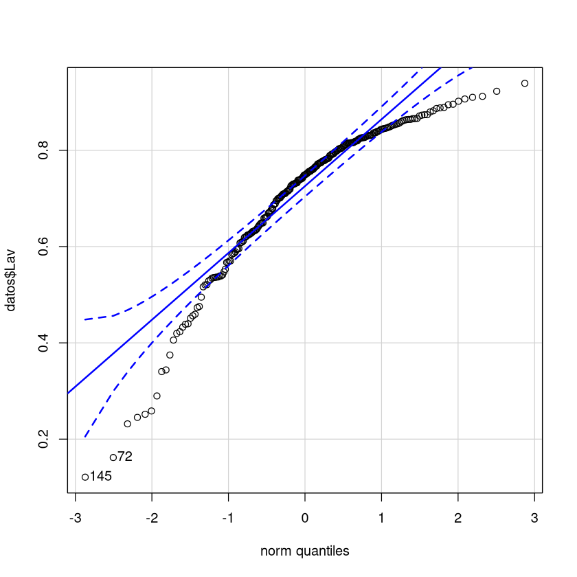
    


### Graficos para variables categoricas

Cargamos nuestra base de datos.


```R
datos2 = read_csv("datos2.csv") # guardamos en una variable "datos2"
```

    Parsed with column specification:
    cols(
      sexo = col_double(),
      nivelest = col_double(),
      tabaco = col_double(),
      estcivil = col_double(),
      laboro = col_double(),
      hijos = col_double(),
      edad = col_double(),
      peso = col_double(),
      talla = col_double(),
      imc = col_double(),
      sedentar = col_double(),
      diabm = col_double(),
      hipercol = col_double(),
      pas = col_double(),
      pad = col_double(),
      fc = col_double()
    )
    


Para comprender la estructura de la base de datos


```R
str(datos2)
```

    tibble [536 × 16] (S3: spec_tbl_df/tbl_df/tbl/data.frame)
     $ sexo    : num [1:536] 2 1 1 2 1 2 2 2 1 1 ...
     $ nivelest: num [1:536] 1 4 2 1 5 1 3 1 1 3 ...
     $ tabaco  : num [1:536] 2 0 NA 0 2 2 3 0 2 0 ...
     $ estcivil: num [1:536] 3 2 4 2 2 4 3 2 2 2 ...
     $ laboro  : num [1:536] 4 3 3 4 1 3 4 4 3 3 ...
     $ hijos   : num [1:536] 2 1 0 2 3 1 2 3 2 0 ...
     $ edad    : num [1:536] 67 56 81 74 53 79 62 69 68 65 ...
     $ peso    : num [1:536] 72 150 71 85 102 98 76 65.5 80 71.4 ...
     $ talla   : num [1:536] 159 178 158 188 178 146 159 145 170 157 ...
     $ imc     : num [1:536] 29 47.3 30 24 32.2 ...
     $ sedentar: num [1:536] 1 1 1 1 1 1 1 1 NA 1 ...
     $ diabm   : num [1:536] 2 2 2 1 1 2 2 2 2 1 ...
     $ hipercol: num [1:536] 2 2 1 1 1 1 2 1 1 2 ...
     $ pas     : num [1:536] 190 192 190 193 182 195 183 184 180 177 ...
     $ pad     : num [1:536] 100 79 95 90 114 95 84 88 91 84 ...
     $ fc      : num [1:536] 9 53 9 82 73 88 66 99 61 65 ...
     - attr(*, "spec")=
      .. cols(
      ..   sexo = col_double(),
      ..   nivelest = col_double(),
      ..   tabaco = col_double(),
      ..   estcivil = col_double(),
      ..   laboro = col_double(),
      ..   hijos = col_double(),
      ..   edad = col_double(),
      ..   peso = col_double(),
      ..   talla = col_double(),
      ..   imc = col_double(),
      ..   sedentar = col_double(),
      ..   diabm = col_double(),
      ..   hipercol = col_double(),
      ..   pas = col_double(),
      ..   pad = col_double(),
      ..   fc = col_double()
      .. )


Ver el encabezado de nuestra base de datos


```R
head(datos2)
```


<table>
<caption>A tibble: 6 × 16</caption>
<thead>
	<tr><th scope=col>sexo</th><th scope=col>nivelest</th><th scope=col>tabaco</th><th scope=col>estcivil</th><th scope=col>laboro</th><th scope=col>hijos</th><th scope=col>edad</th><th scope=col>peso</th><th scope=col>talla</th><th scope=col>imc</th><th scope=col>sedentar</th><th scope=col>diabm</th><th scope=col>hipercol</th><th scope=col>pas</th><th scope=col>pad</th><th scope=col>fc</th></tr>
	<tr><th scope=col>&lt;dbl&gt;</th><th scope=col>&lt;dbl&gt;</th><th scope=col>&lt;dbl&gt;</th><th scope=col>&lt;dbl&gt;</th><th scope=col>&lt;dbl&gt;</th><th scope=col>&lt;dbl&gt;</th><th scope=col>&lt;dbl&gt;</th><th scope=col>&lt;dbl&gt;</th><th scope=col>&lt;dbl&gt;</th><th scope=col>&lt;dbl&gt;</th><th scope=col>&lt;dbl&gt;</th><th scope=col>&lt;dbl&gt;</th><th scope=col>&lt;dbl&gt;</th><th scope=col>&lt;dbl&gt;</th><th scope=col>&lt;dbl&gt;</th><th scope=col>&lt;dbl&gt;</th></tr>
</thead>
<tbody>
	<tr><td>2</td><td>1</td><td> 2</td><td>3</td><td>4</td><td>2</td><td>67</td><td> 72</td><td>159</td><td>29.00000</td><td>1</td><td>2</td><td>2</td><td>190</td><td>100</td><td> 9</td></tr>
	<tr><td>1</td><td>4</td><td> 0</td><td>2</td><td>3</td><td>1</td><td>56</td><td>150</td><td>178</td><td>47.34251</td><td>1</td><td>2</td><td>2</td><td>192</td><td> 79</td><td>53</td></tr>
	<tr><td>1</td><td>2</td><td>NA</td><td>4</td><td>3</td><td>0</td><td>81</td><td> 71</td><td>158</td><td>30.00000</td><td>1</td><td>2</td><td>1</td><td>190</td><td> 95</td><td> 9</td></tr>
	<tr><td>2</td><td>1</td><td> 0</td><td>2</td><td>4</td><td>2</td><td>74</td><td> 85</td><td>188</td><td>24.04934</td><td>1</td><td>1</td><td>1</td><td>193</td><td> 90</td><td>82</td></tr>
	<tr><td>1</td><td>5</td><td> 2</td><td>2</td><td>1</td><td>3</td><td>53</td><td>102</td><td>178</td><td>32.19290</td><td>1</td><td>1</td><td>1</td><td>182</td><td>114</td><td>73</td></tr>
	<tr><td>2</td><td>1</td><td> 2</td><td>4</td><td>3</td><td>1</td><td>79</td><td> 98</td><td>146</td><td>46.00000</td><td>1</td><td>2</td><td>1</td><td>195</td><td> 95</td><td>88</td></tr>
</tbody>
</table>


#### Descripcion de la base de datos


Nos centraremos unicamente en el sexo y el estado civil <br>
Para el sexo tenemos: <br>
**1 = Masculino, 2 = Femenino** <br>
Para el estado civil: <br>
**1 =  Soltero, 2 = Casado/Pareja, 3 = Separado, 4 = Viudo**

Contaremos el numero de hombres y mujeres y los uniremos
en un vector


```R
nSexo <- c(sum(datos2$sexo==1),sum(datos2$sexo==2))
```

Categorizaremos los sexos


```R
Sexo <- c("Masculino", "Femenino")
```

Calcularemos el porcentaje


```R
porcentaje <- round(nSexo/sum(nSexo)*100)
```

Lo hacemos bonito


```R
Sexo <- paste(Sexo, porcentaje)
Sexo <- paste(Sexo, " %")
```

#### Grafica de pastel


```R
pie(nSexo,labels = Sexo)
```


    
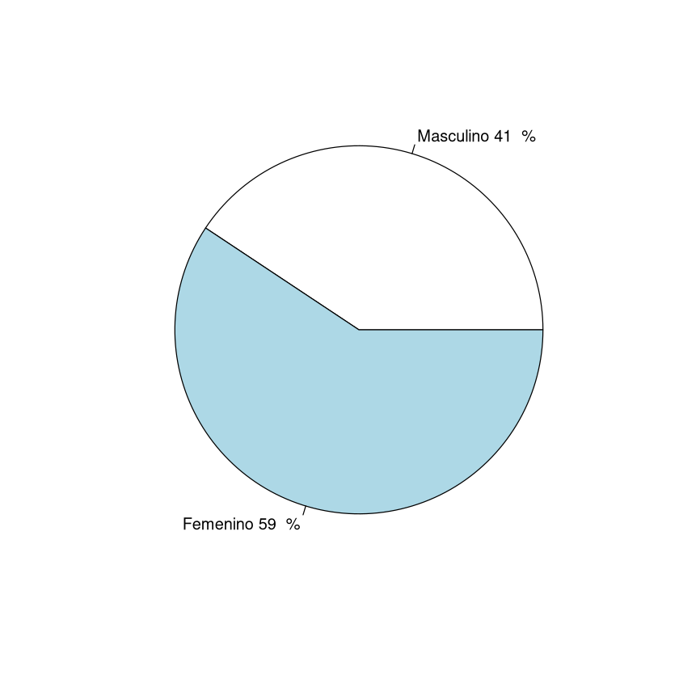
    


#### Grafica de barras
Para ello necesitamos convertir a factor


```R
sex <- factor(datos2$sexo)
plot(sex)
```


    
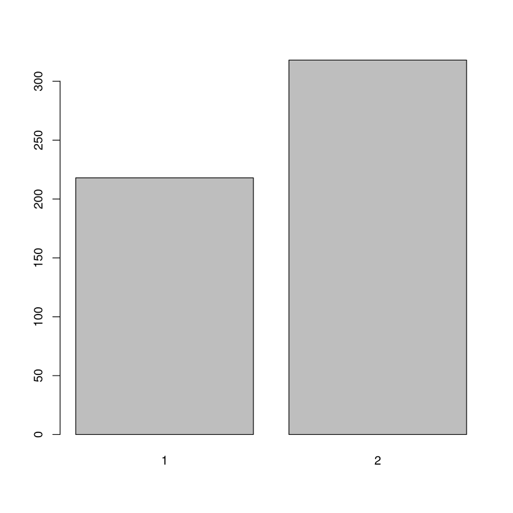
    


La funcion **par()** se utiliza para configuraciones de graficas en general <br>
Con ***mfrow = c(n,m)*** se configura el numero de graficas desplegadas
a la vez


```R
par(mfrow=(c(1,2))) 
```

##### Graficos de dispersion (puntos y sunflower)

Grafico de puntos


```R
plot(estcivil ~ sexo, data=datos2)
title("Grafica de puntos")
```


    

    


##### Grafico sunflower


```R
sunflowerplot(estcivil ~ sexo, data=datos2)
title("Grafica Sunflower")
```


    
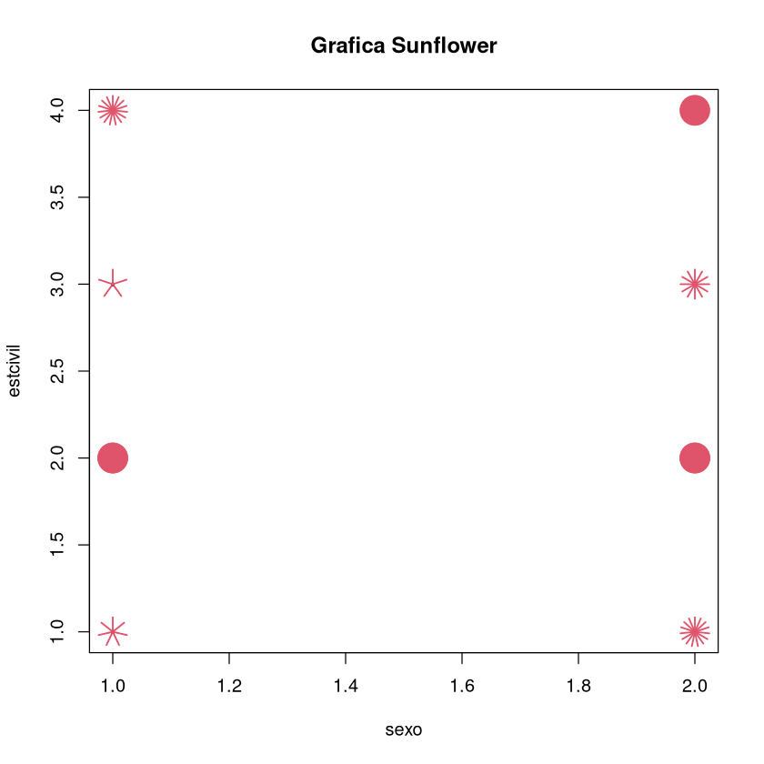
    


Regresemos las graficas a la normalidad


```R
par(mfrow=(c(1,1)))
```

##### Mosaicplot

Cuando quieres observar la proporci?n de variables categorica vs categorica


```R
mosaicplot(sexo~estcivil,data=datos2)
```


    
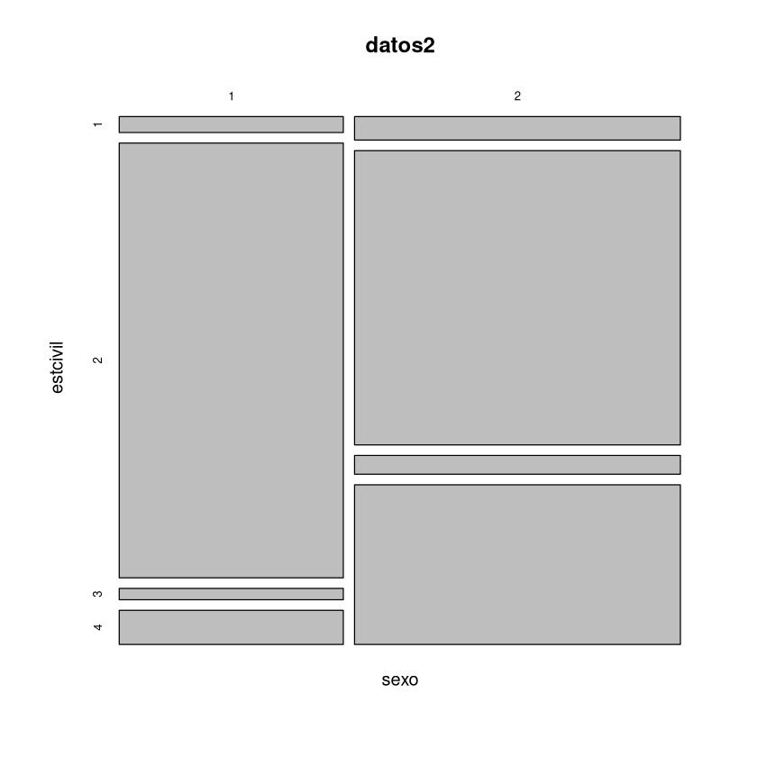
    

